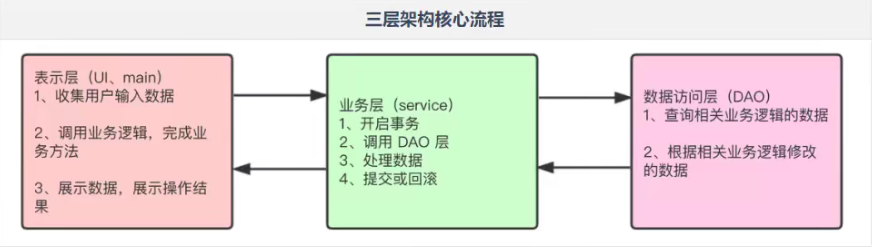

# jdbc_simple_practice
more and more

## 准备
mysql-connect-java-5.x.bin.jar对应 mysql 5.x，新建java项目，新建lib文件夹，将jar包驱动移到lib中，右键lib添加为库

## JDBC_demo
+ 1.加载驱动
+ 2.获得连接对象
+ 3.获得发送SQL语句工具
+ 4.设置动态参数
+ 5.执行SQL，处理结果
+ 6.关闭资源

## 工具类的封装
DBUtils实现加载驱动、获得连接对象、关闭资源

## 跨平台方案
在src目录下新建db.properties配置文件
定义 `private static final Properties PROPERTIES = new Properties();` 读取配置文件Map
定义 
```
    static {
        // 首次使用工具类 加载驱动 
        InputStream is = DBUtils.class.getResourceAsStream("/db.properties");
        // 通过流将配置文件内容加载到properties集合 把Map配置信息分割成键值对
        PROPERTIES.load(is);
        //通过getProperty("xxx")获取对应的值 
        Class.forName(PROPERTIES.getProperty("driver"));
}
```
## ORM（Object Relational Mapping）
* 一行数据中，多个零散的数据进行整理
* 通过entity实体类的规则对表中的数据进行对象封装
* 表名=类名 属性名=列名
* 提供各个属性的get、set方法
## Dao（Date Access object）
```sql
CREATE TABLE Person(
	id INT PRIMARY KEY AUTO_INCREMENT,
	name VARCHAR(20) NOT NULL,
	age INT NOT NULL,
	bornDate DATE,
	email VARCHAR(20),
	address VARCHAR(20)
	)CHARSET=utf8;
```
对同一张表的所有操作封装在XxxDaoImpl对象中

## 实体的重要性


## java.util.Date和java.sql.Date和String
在java中，存储日期用到的是java.util.Date，在数据库中，存储日期用到的java.sql.Date，面对用户，传入的值大概率会是字符串，所以就涉及到他们互相转换的问题

`SimpleDateFormat sdf = new SimpleDateFormat("yyyy-MM-dd");`
1.字符串转换为util.Date
用到SimpleDateFormat实例的parse方法
`java.util.Date date = sdf.parse(str);`
2.util.Date转换为字符串
`return sdf.format(java.util.Date date);`
3.sql.Date转化为util.Date
sql.Date不支持转换，只能通过与1970年相差的毫秒值创建
`return new java.sql.Date(java.util.Date date.getTime());`

## Service业务逻辑
站在用户角度，一个功能即是一个业务，可能需要多个DAO组成
AccountServiceImpl利用AccountDaoImpl的update和select方法完成了转账业务逻辑编写
需要注意的是，转账中事务需要统一用一个connection，所以用到了ThreadLocal解决:`private static ThreadLocal<Connection> threadLocal = new ThreadLocal<>();`
`Connection connection = threadLocal.get();//将当前线程中绑定的Connection对象赋值给connection`
`threadLocal.set(connection);//把连接存在当前线程共享中`

### 三层架构
1.表示层
命名：XXXView
职责：收集用户的数据和需求、展示数据
2.业务逻辑层
命名：XXXServiceImpl
职责：数据加工处理、调用DAO完成业务实现、控制事务
3.数据访问层
命名：XXXDaoImpl
职责：向业务层提供数据，将业务层加工后的数据同步到数据库


数据访问层AccountDaoImpl采用AccountDao接口实现，让DaoImpl迭代更方便、灵活
业务逻辑层AccountServiceImpl采用AccountService接口实现，让ServiceImpl迭代更方便、灵活


* Utils存放工具类：DBUtils
* entity存放实体类：Person
* dao存放DAO接口（PersonDao）
 + impl存放DAO接口实现类（PersonDaoImpl）
* service存放service接口（PersonService）
 + impl存放service接口实现类（PersonServiceImpl）
* view存放程序启动类（main）
